# Makefile

## 1. Cài đặt cgwin và trình biên dịch cho makefile
Manual download Cgwin: https://www.youtube.com/watch?v=pWe8UpR1Uqg

Download Cgwin: https://www.cygwin.com/

Package download: make, m4, perl, perl-html-parser, python, bash-completion


## 2. Cấu trúc makefile, biến PHONY, chỉ định Makefile

- Make file là một script bên trong có chứa các thông tin

    - Cấu trúc của một project (file, dependency)

    - Các command line dùng để tạo-hủy file

- **Chương trình make**: đọc nội dung trong **Makefile** và thực thi nó

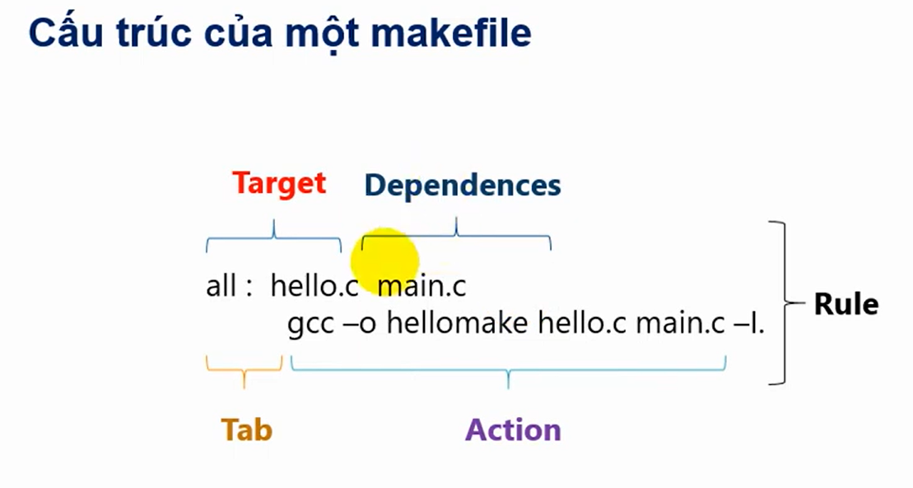

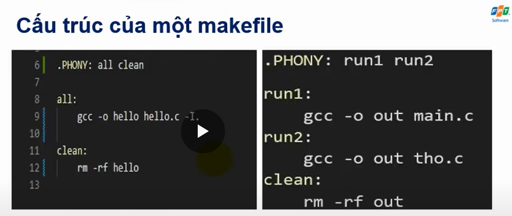


```c
.PHONY: all clean

all: main.c 
	gcc -o app main.c

clean:
	rm app.exe
```
- **.PHONY:** all clean
Đảm bảo make all hoặc make clean luôn thực thi **kể cả khi có file tên là all hoặc clean tồn tại trong thư mục.**

- Tránh xung đột khi có file trùng tên với các mục tiêu.

### Trường hợp có 2 file Makefile & a.mk

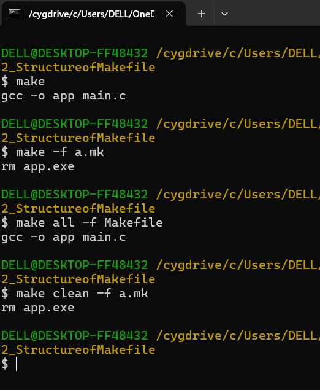

-> lệnh -f để gọi ra các file make tương ứng

## 3. Biến và include trong makefile

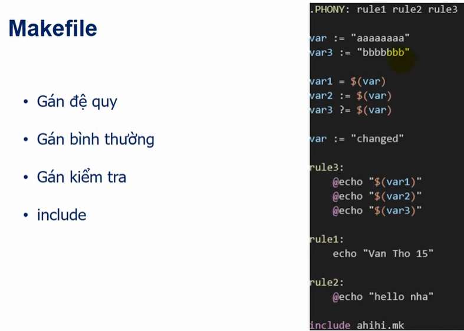

### 3.1. Các kiểu gán biến trong Makefile

- **Gán đơn giản**

```c
var := "aaaaaaaa"      # Gán ngay (immediate / đơn giản)
var3 := "bbbbbbb"
```
```c
# Gán theo cách khác nhau để minh họa
var1 = $(var)         # Gán đệ quy (giá trị tính khi sử dụng)
var2 := $(var)        # Gán ngay (giá trị cố định tại thời điểm này)
var3 ?= $(var)        # Gán nếu var3 chưa có giá trị (nhưng ở trên đã có rồi)
```
- **Gán đệ quy**

    - Trị số được tính khi sử dụng, không phải khi gán

    - Nếu var thay đổi thì var1 thay đổi theo

- **Gán kiểm tra**

    - Chỉ gán khi biến đó chưa có giá trị

### **3.2. Rules trong Makefile**

```c
rule3:
	@echo "${var1}"
	@echo "${var2}"
	@echo "${var3}"

```

- @echo:
In giá trị ra terminal.

    @ giúp ẩn lệnh, chỉ hiển thị kết quả.

- var1 = $(var) → lấy giá trị var lúc chạy → "changed"

- var2 đã giữ "aaaaaaaa" (do :=) → in "aaaaaaaa"

- var3 đã được gán là "bbbbbbb" → in "bbbbbbb"

### 3.3. Include trong makefile

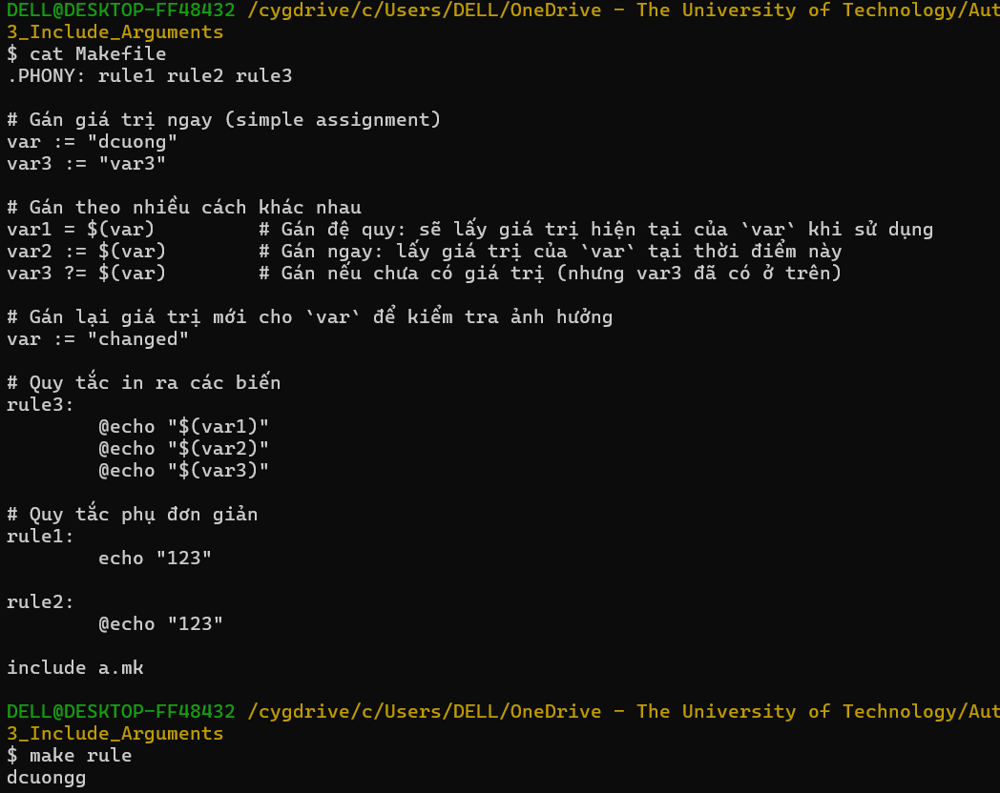

## 4. Các biến đặc biệt và echo trong Makefile

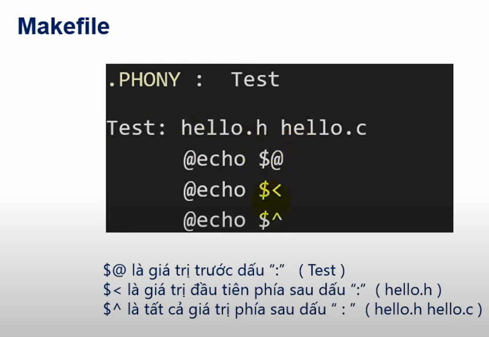

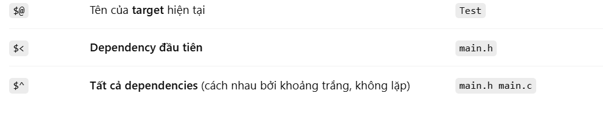

## 5. Build file .h

- Build file .h ở thư mục header

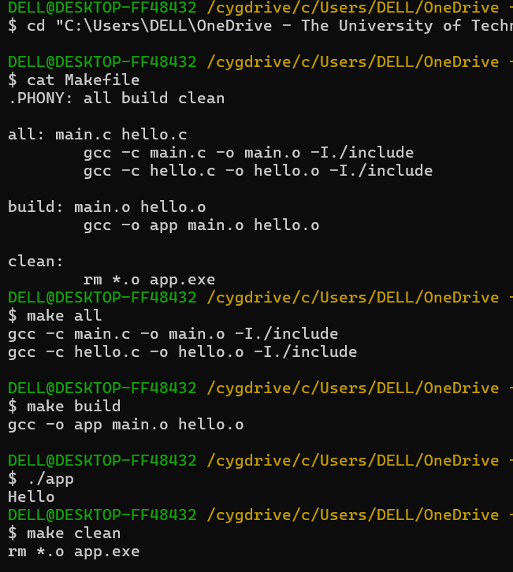

```c
# Khai báo các target giả (không phải là tên file thật), để Make luôn thực thi
.PHONY: all build clean

# Target "all": Biên dịch các file .c thành file .o (object)
all: main.c hello.c
	# Biên dịch main.c thành main.o, thêm thư mục include để tìm file .h
	gcc -c main.c -o main.o -I./include
	# Biên dịch hello.c thành hello.o, thêm thư mục include để tìm file .h
	gcc -c hello.c -o hello.o -I./include

# Target "build": Liên kết các file object thành file thực thi "app"
build: main.o hello.o
	# Tạo file thực thi app từ các file object
	gcc -o app main.o hello.o

# Target "clean": Xóa các file sinh ra trong quá trình biên dịch
clean:
	# Xóa tất cả các file .o, file app.exe và file comment nếu tồn tại
	rm *.o app.exe comment

```

## 6. 4 Stage của quá trình biên dịch trong C (make file)

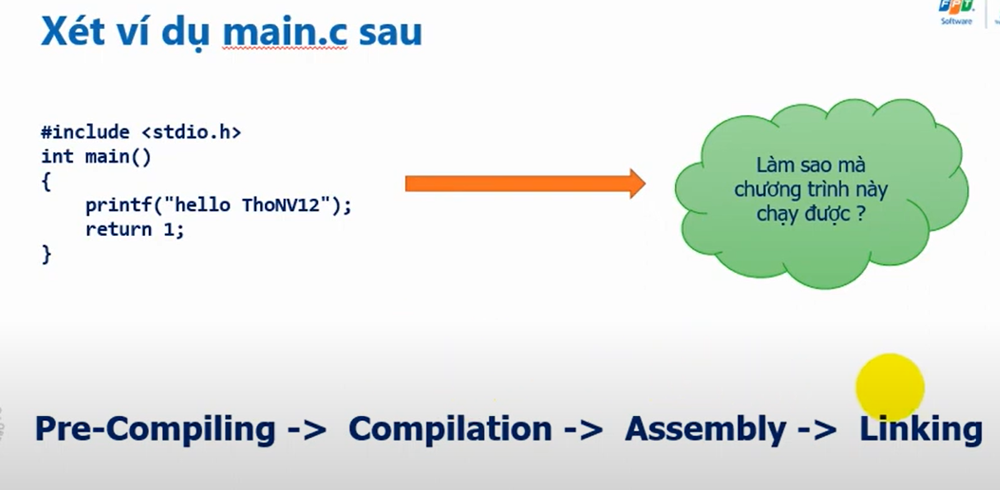

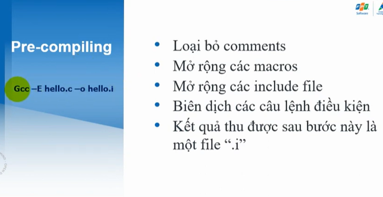

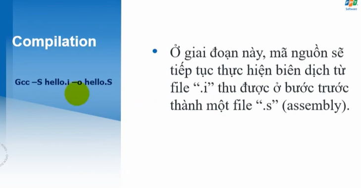

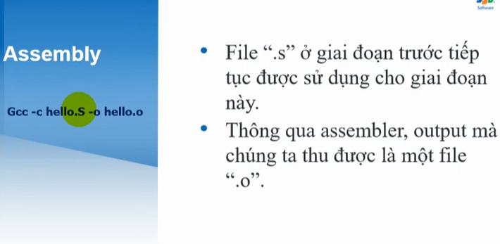

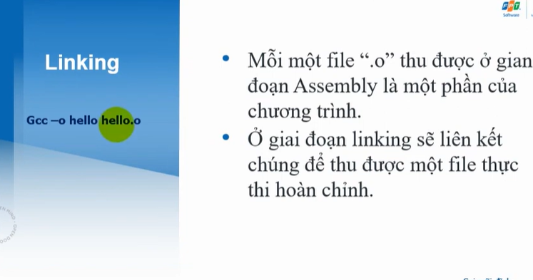

## 7. Chia các folder trong 1 Project

```c
.PHONY: all

CC := gcc
INC_FILE := ./Inc/hieu.h
INC_FILE += ./Inc/tong.h

%.o: $(INC_FILE)
	$(CC) -c Src/hieu.c -o obj/hieu.o -I./Inc
	$(CC) -c Src/tong.c -o obj/tong.o -I./Inc
	$(CC) -c main.c -o obj/main.o -I./Inc

tong: obj/tong.o obj/main.o
	$(CC) -o bin/out.exe obj/tong.o obj/main.o

hieu: obj/hieu.o obj/main.o
	$(CC) -o bin/out.exe obj/hieu.o obj/main.o

run:
	.\bin\out.exe
clean:
	rm ./obj/*.o
```

- Tạo biến `INC_FILE` chứa đường dẫn đến hai file header. Dòng đầu **khởi tạo**, dòng sau **nối thêm** (sử dụng +=) để có 2 file header.

- `%.o: $(INC_FILE)`: build file .o khi file .h thay đổi

## 8. Implicit Rule, Automatic variables, Pattern rules & cách tự động build trong Makefile

```c
.PHONY: hello

CC := gcc
CFLAGS := -I.

INC_FILE := hello.h

%.o: %.c $(INC_FILES)
	$(CC) -o $@ $<

hello: main.o hello.o
	$(CC) -o $@ $^ $(CFLAGS)

clean: 
	rm hello *.o
```

Việc chạy các implicit rule và các automatic variables, mỗi lần build thì không biết file nào thay đổi hay có lỗi ở file đó nhưng Makefile vẫn build và tạo ra file .exe -> **Pattern rules**
### Pattern Rules
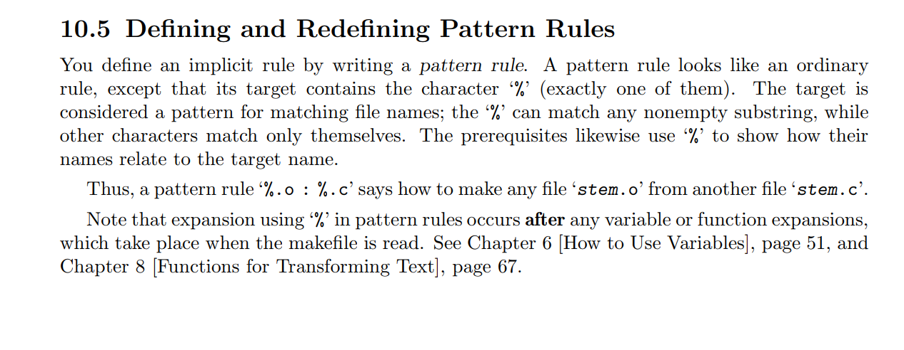

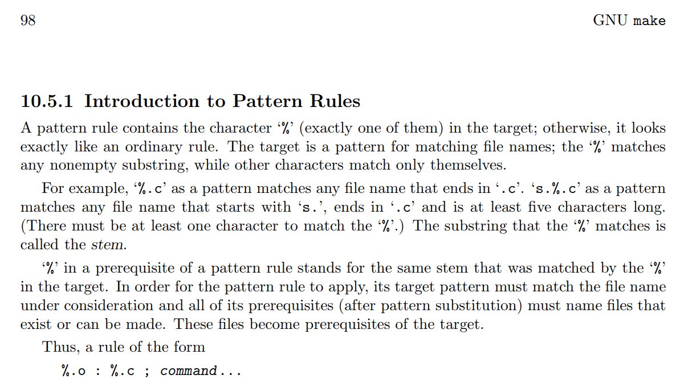

```c
%.o: %.c $(INC_FILES)
	$(CC) -o $@ $<
```

-> **Những file có thay đổi mới build ra, báo lỗi**

## 9. Static Lib & Share Lib

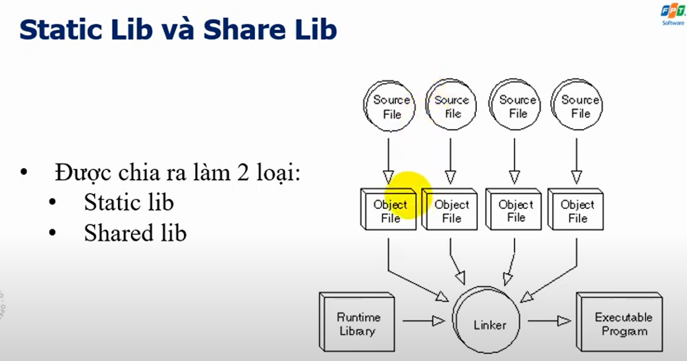

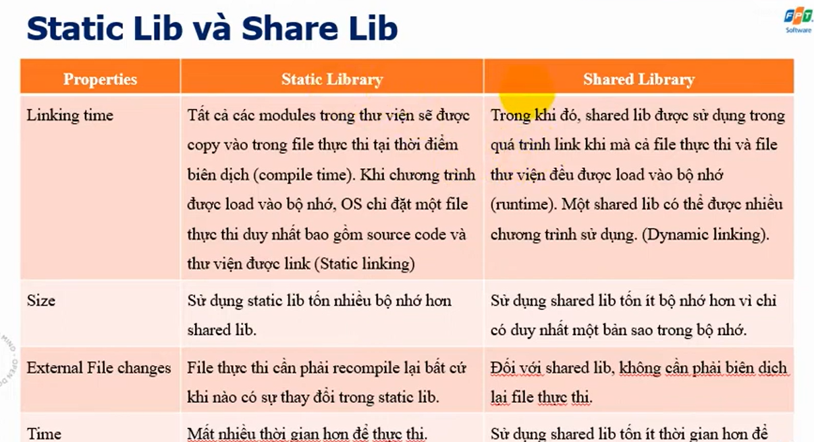

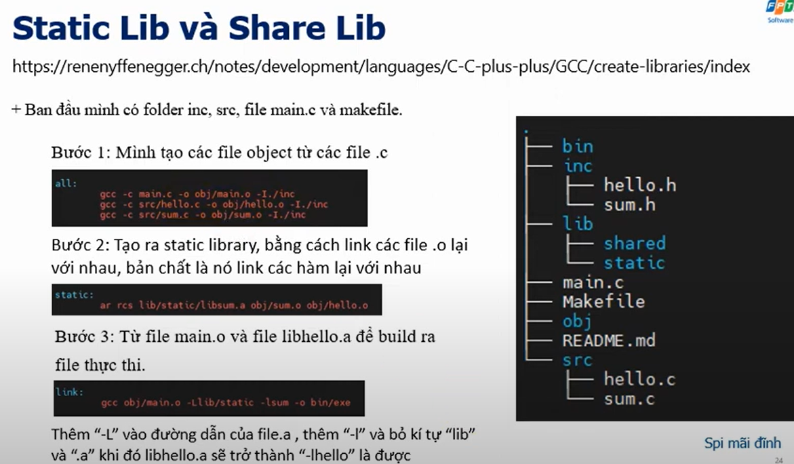

Follow the link: https://renenyffenegger.ch/notes/development/languages/C-C-plus-plus/GCC/create-libraries/index

## 10. VPATH

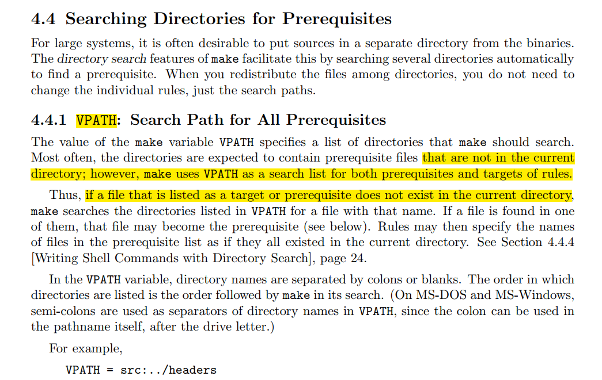